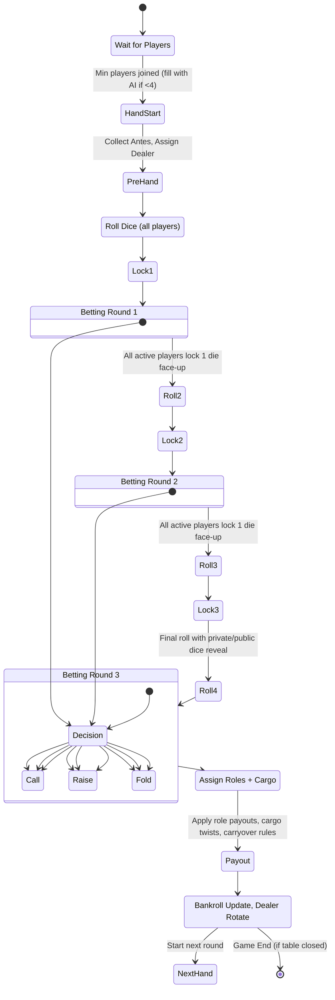

## Game State Machine



## Hand Resolution Flow

```mermaid
flowchart TD
    A[Start Hand] --> B[Collect Blinds / Antes]
    B --> C[Roll 1]
    C --> D[Betting Round 1]
    D --> E[Roll 2 + Lock 1 Die Face-up]
    E --> F[Betting Round 2]
    F --> G[Roll 3 + Lock 1 Die Face-up]
    G --> H[Betting Round 3]
    H --> I[Showdown: Assign Roles]
    
    %% Role assignment
    I --> J{Roles Filled?}
    J -->|All 3| K[Base Split: Ship 40% / Captain 30% / Crew 20% / Non-Roles 10%]
    J -->|Only 2 Roles| L[Unfilled Role's Share Split Evenly Between Remaining Roles]
    J -->|Only 1 Role| M[That Role Takes Entire Pot]
    
    %% Cargo twist
    K --> N[Check Cargo Dice (1s, 2s, 3s from all active players)]
    L --> N
    M --> N
    N --> O{Plurality Face in Cargo}
    O -->|1s| P[Non-Roles Split 50% of Crew Share]
    O -->|2s| Q[Captain Takes Crew's Share]
    O -->|3s| R[Crew Takes 50% of Captain's Share]
    O -->|No Clear Plurality| S[No Change to Shares]
    
    %% Settlement
    P --> T[Distribute Pot by Final Shares]
    Q --> T
    R --> T
    S --> T
    T --> U[Update Bankrolls]
    U --> V[Rotate Dealer]
    V --> W[Start Next Hand]
```
